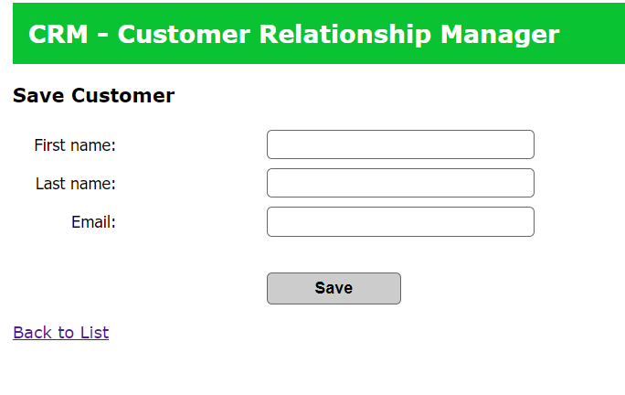
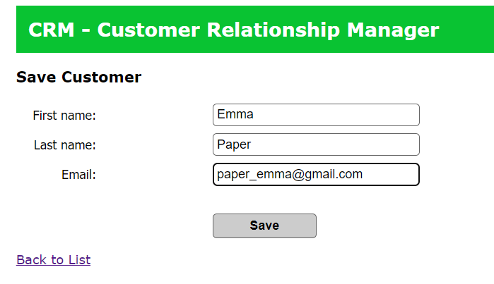

# Customer-Relationship-Manager-Spring-MVC
## Summarize

To summarize i developed Spring MVC project which creating, reading, updating and deleting customer data from the website. As shown below pictures there are save, update, delete buttons and search box. You can do all operations easily and sort them by "firstname", "lastname" and "email" by clicking the titles.

## Pictures from project
Project             |  Pictures
:-------------------------:|:-------------------------:
  |  
  |  
  |  
  |  

